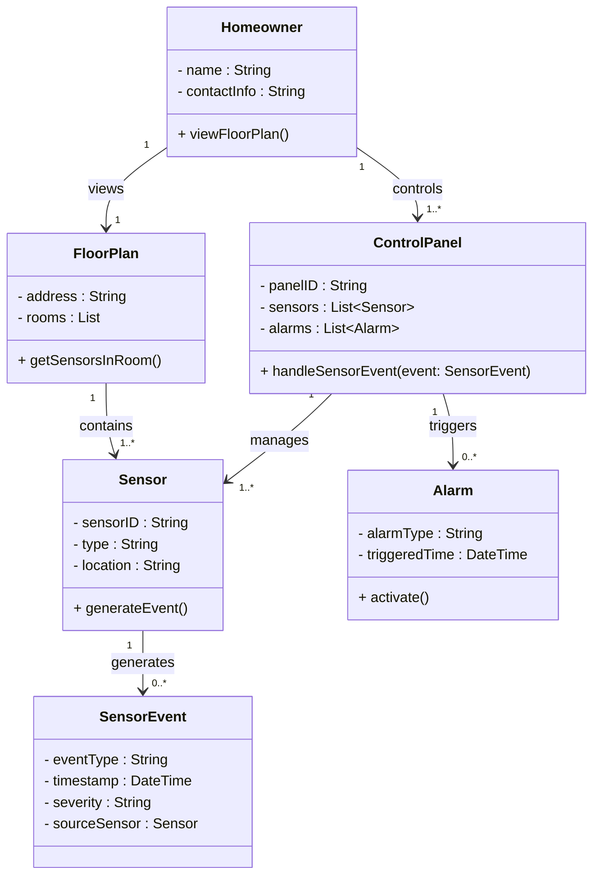
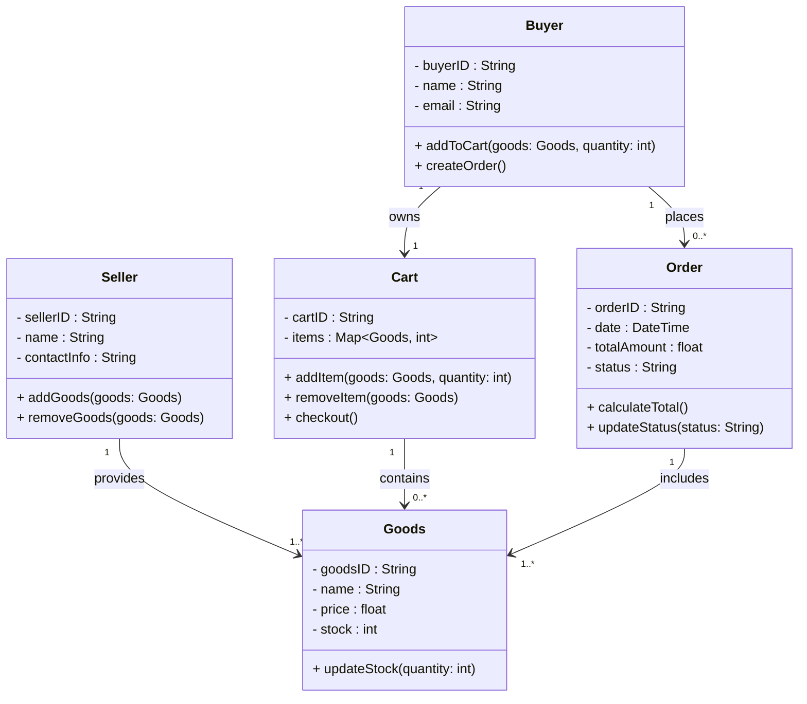
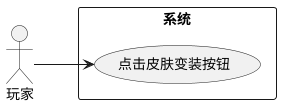
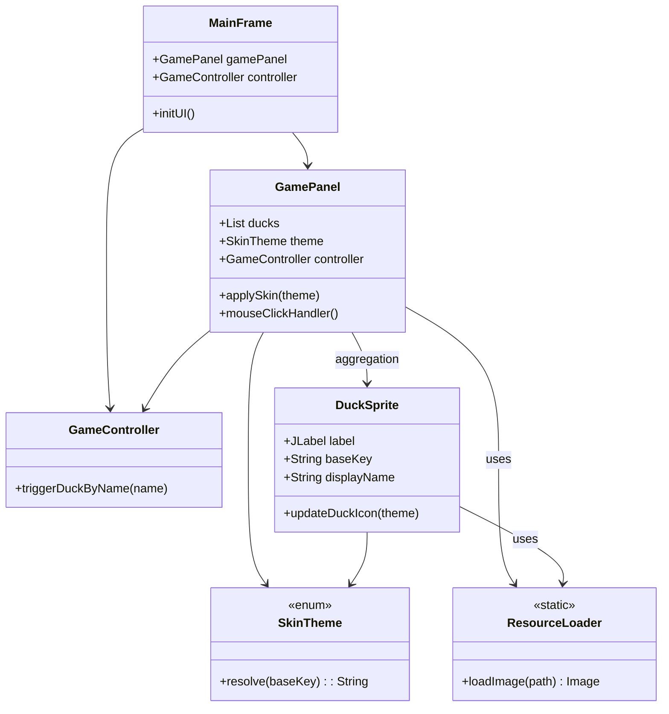
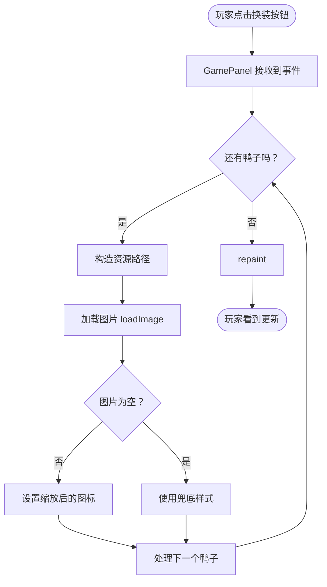
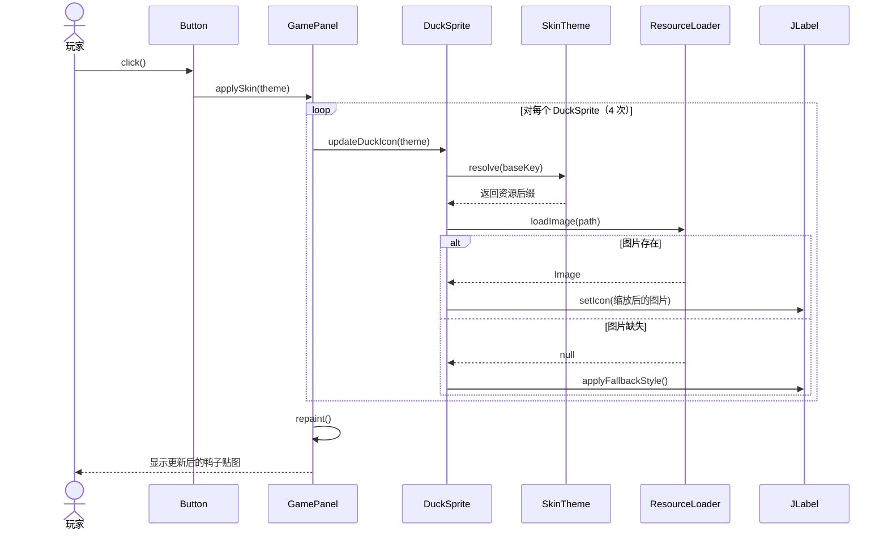

# 构想一个新的项目，项目的初步内容如下： 
1.具体对象：一个唐老鸭和三只不同颜色的唐小鸭，其中，三只唐小鸭喜好各不相同，有的喜好抢红包，有的喜好玩游戏，有的喜好睡觉等... 
2.游戏逻辑：用户可以通过鼠标点击唐老鸭，与唐老鸭实现“交互”。当用户鼠标点击唐老鸭时，唐老鸭会给出一个对话框，用户在对话框中输入文字信息。输入确认后，进行“关键字索取”，例如，当输入的内容含有“发红包”这个关键词时，则选择拥有相应喜好的唐小鸭，开始进行发红包这个游戏，例如，当输入内容含有“统计代码量”这一关键词时，则给出该项目所有文件的代码统计tokei，例如，当输入内容含有“ai对话”这一关键信息时，则本地部署并开始调用相应的大模型api，实现ai交互...... 
3.游戏界面：主界面为左下角是唐老鸭，右侧三只唐小鸭，界面底部有可以询问的功能或者游戏类型。当用户在对话框中输入信息，如果检索到关键词，则界面进行跳转，实现相应的功能；如果没有检索到相应的关键词信息，则对话框弹出提示信息...... 上述内容为初步的游戏项目demo，后续可能会一步步完善并增添更多内容。请注意，现在我希望你能帮我组织项目的结构，学习之前例子的渐进式建模思想，将模块合理分层，方便后续模块添加和功能完善。同时，请注意，现在我希望你只帮我实现主界面的ui设计和项目组织文件分层，通过java实现，其他具体的功能
* 唐小鸭换装触发
* tokei图形化界面ui
* 发红包-装饰模型
* AI大模型api接入：访问通义千问平台，通过应用手册部署并调用qianwen大模型
# 项目结构
```bash
DonaldGame/
├─ src/
│  ├─ model/           # 数据与角色建模（唐老鸭、唐小鸭）
│  ├─ view/            # 图形界面（Swing UI层）
│  ├─ controller/      # 控制层（处理用户输入、事件监听、场景切换）
│  ├─ service/         # 业务逻辑层（后续可添加AI对话、发红包、统计代码等）
│  ├─ util/            # 工具类（关键字匹配、资源加载）
│  └─ Main.java        # 程序入口
├─ resources/          # 图片、音效、配置文件
│  ├─ images/
│  │  ├─ donald.png
│  │  ├─ duck_red.png
│  │  ├─ duck_blue.png
│  │  └─ duck_yellow.png
│  └─ config/
│     └─ keywords.json  # 关键词配置
└─ README.md

```

```bash
com.duckgame
├── main
│   └── Main.java                  // 程序入口
│
├── ui
│   ├── GameFrame.java             // 主窗口（包含鸭子和对话区）
│   ├── DuckPanel.java             // 绘制鸭子组件面板
│   ├── DialogPanel.java           // 用户对话输入面板
│
├── model
│   ├── Duck.java                  // 鸭子抽象类（公有属性：名字、颜色、位置等）
│   ├── DonaldDuck.java            // 唐老鸭（可交互）
│   ├── LittleDuck.java            // 唐小鸭（有不同喜好）
│   ├── HobbyType.java             // 枚举类：喜好类型（发红包、玩游戏、睡觉）
│
├── controller
│   ├── GameController.java        // 控制 UI 与逻辑交互
│   └── KeywordManager.java        // 管理关键词与功能映射（后续可扩展）
│
└── util
    └── ImageLoader.java           // 工具类：加载图片资源

```

```plaintext
                ┌───────────────────────────┐
                │        GameController     │
                │───────────────────────────│
                │ - ducks: List<Duck>       │
                │ - dialogPanel: DialogPanel│
                │ - duckPanel: DuckPanel    │
                │───────────────────────────│
                │ + handleUserInput(String) │
                │ + updateUI()              │
                └───────────▲───────────────┘
                            │
                            │ uses
                            │
┌────────────────────────────────────┐        ┌─────────────────────┐
│             GameFrame              │<>─────▶│    GameController   │
│────────────────────────────────────│        └─────────────────────┘
│ - duckPanel: DuckPanel             │
│ - dialogPanel: DialogPanel         │
│────────────────────────────────────│
│ + initUI()                         │
│ + main(String[])                   │
└────────────────────────────────────┘
           ▲                 ▲
           │ contains        │ contains
           │                 │
 ┌────────────────────┐     ┌────────────────────┐
 │     DuckPanel      │     │   DialogPanel      │
 │────────────────────│     │────────────────────│
 │ + paintComponent() │     │ + getUserInput()   │
 │ + addClickListener()│    │ + showResponse()   │
 └────────────────────┘     └────────────────────┘


                   ┌───────────────────────────────┐
                   │            Duck               │
                   │───────────────────────────────│
                   │ - name: String                │
                   │ - color: Color                │
                   │ - position: Point             │
                   │───────────────────────────────│
                   │ + draw(Graphics g)            │
                   │ + onClick()                   │
                   └──────────▲───────────┬────────┘
                              │           │
         ┌────────────────────┘           └────────────────────┐
         │                                               │
┌────────────────────────────┐              ┌──────────────────────────┐
│       DonaldDuck           │              │        LittleDuck        │
│────────────────────────────│              │──────────────────────────│
│ + onClick(): void           │              │ - hobby: HobbyType       │
│ + speak(): String           │              │ + performHobby(): void   │
└────────────────────────────┘              └──────────────────────────┘


┌──────────────────────────┐
│       HobbyType          │
│──────────────────────────│
│ + RED_PACKET             │
│ + GAME                   │
│ + SLEEP                  │
└──────────────────────────┘

```





## 用例图（use case）


## 类图（class diagram）


## 活动图（activity diagram）


## 顺序图（sequence diagram）

## 唐老师点名
1.点名方式：全点/抽点，如果选择“全点”，则按顺序点名，如果选择“抽点”，则继续选择点名人数：10/15/20/自定义；然后唐老师选择点名策略；随机选取/优先选择旷课次数最多的同学/优先选择点到次数最小的同学（以上选择都在一个对话框内实现）。
2.开始点名之后，语音播报每位同学的姓名，同时界面上显示相应的姓名、学号和照片。如果该同学回答”到“，则考勤数据为”出勤“；
如果无人回答，但该同学在点名之前递交了假条，则考勤为”请假“，否则为”旷课”；如果旷课的同学在10分钟以内赶到教室，则考勤修改为
“迟到”。（其中“到”“请假”“迟到”“旷课”可以做成在ui界面上手动选择）
3.每次点名数据都有记录，根据记录可以进行汇总。

```yaml
【Swing UI】
    |
    | 调用
    v
【RollCallService】
    |
    | 调用
    v
【RollCallRepository（DAO）】
    |
    | 调用
    v
【DataSourceFactory（连接池工厂）】
    |
    | 返回 HikariDataSource
    v
【HikariCP】
    |
    | getConnection()
    v
【PostgreSQL 数据库】

```
待定。